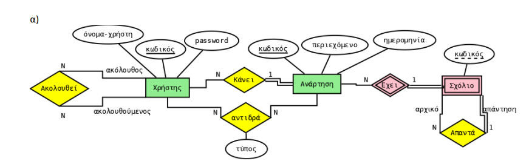
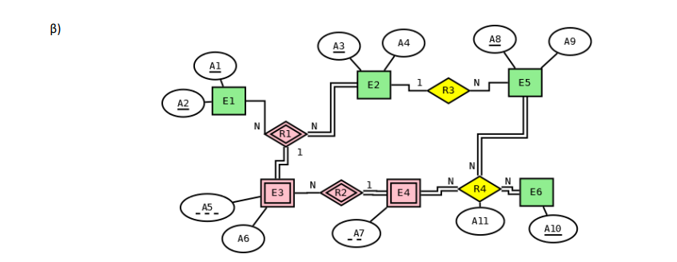
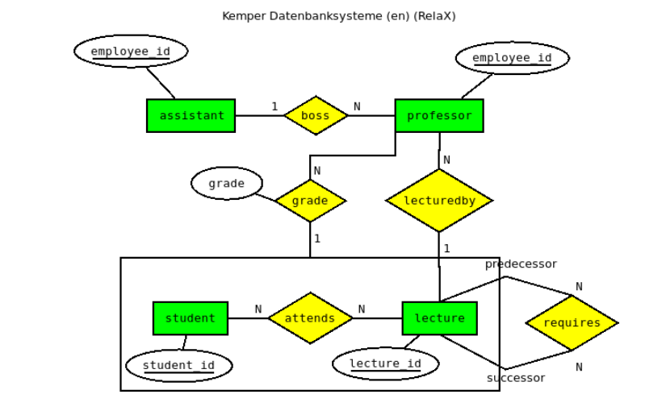
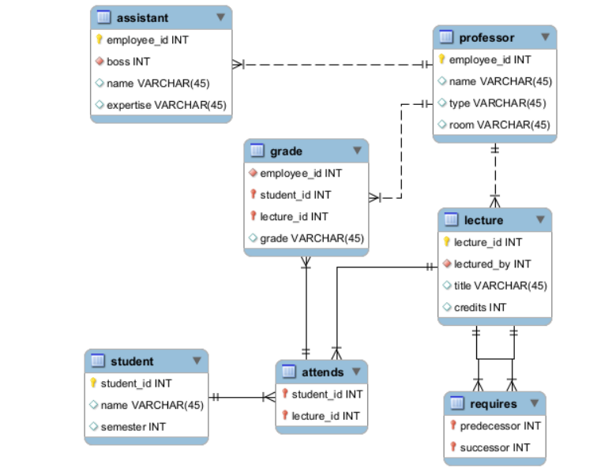
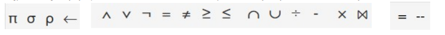
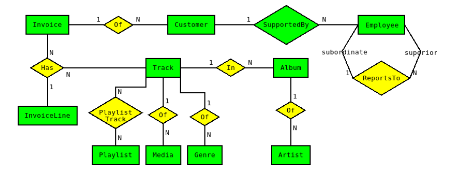
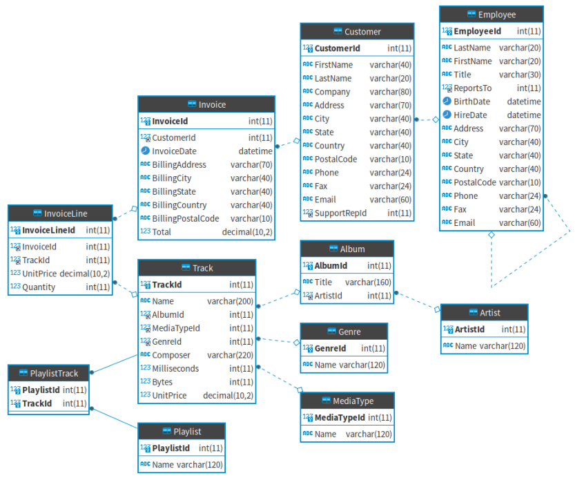

# [Homework 1](./HW-1)  
#### 1) Θέλετε να σχεδιάσετε μια βάση δεδομένων για μια εταιρεία διαχείρισης πολυκατοικιών. Συγκεκριμένα:
  -  Η εταιρεία διαχειρίζεται κτίρια. Για κάθε κτίριο καταγράφουμε έναν μοναδικό κωδικό, τη διεύθυνση και το έτος κατασκευής.
  - Κάθε κτίριο διαθέτει διαμερίσματα. Για κάθε διαμέρισμα διατηρούμε τον αριθμό του και τοεμβαδόν του. Υποθέτουμε ότι ο αριθμός του διαμερίσματός είναι μοναδικός     μέσα σε κάθε κτίριο.
  - Η βάση επίσης καταγράφει πληροφορία για ιδιοκτήτες και ενοικιαστές. Για όλα τα άτομακαταγράφεται το ονοματεπώνυμο τους καθώς και ένα τηλέφωνο επικοινωνίας.         Επιπλέον, για τους ιδιοκτήτες καταγράφεται το ΑΦΜ τους, ενώ για τους ενοικιαστές η ημερομηνία έναρξης του συμβολαίου τους.
  - Ένας ιδιοκτήτης μπορεί να έχει πολλά διαμερίσματα και ένα διαμέρισμα μπορεί να ανήκει σε περισσότερους από έναν ιδιοκτήτες.
  - Οι ενοικιαστές νοικιάζουν διαμερίσματα. Ένας διαμέρισμα μπορεί να ενοικιάζεται μόνο σε έναν ενοικιαστή σε μια δεδομένη χρονική στιγμή, ενώ διατηρούμε και το        χρονικό διάστηματης ενοικίασης (διάρκεια συμβολαίου).

#### 2) Θέλετε να σχεδιάσετε μια βάση δεδομένων για μια εταιρία που αναπτύσσει λογισμικό. Συγκεκριμένα: 
  - Κάθε εργαζόμενος διαθέτει έναν μοναδικό κωδικό, ονοματεπώνυμο και θέση εργασίας. 
  -  Για τα έργα λογισμικού (projects) καταγράφουμε έναν μοναδικό κωδικό, το όνομα του έργου και την ημερομηνία παράδοσης.
  -  Κάθε έργο αποτελείται από εργασίες. Για κάθε εργασία διατηρούμε το όνομα και την εκτιμώμενη διάρκεια της. Υποθέτουμε ότι δεν υπάρχουν δύο εργασίες με το ίδιο       όνομα στο ίδιο έργο.
  - Σε κάθε εργασία μπορεί να συμμετέχουν πολλοί εργαζόμενοι.
  - Ένας εργαζόμενος μπορεί να επιβλέπεται από έναν άλλο εργαζόμενο της εταιρείας. Ένας εργαζόμενος μπορεί να επιβλέπει πολλούς άλλους εργαζόμενους, αλλά κάθε          εργαζόμενος έχει το πολύ έναν άμεσο επιβλέποντα.
  - Τέλος, θέλουμε να καταγράφουμε ότι μια εργασία μπορεί να εξαρτάται από την ολοκλήρωση άλλης εργασίας του ίδιου έργου.

#### 3) Θέλετε να σχεδιάσετε μια βάση δεδομένων για ένα σύστημα που διαχειρίζεται επιστημονικά συνέδρια και τις εργασίες που υποβάλλονται σε αυτά. Συγκεκριμένα:
  -  Για κάθε συνέδριο καταγράφεται το όνομα του συνεδρίου και το έτος διεξαγωγής του.
  -  Για κάθε ερευνητή καταγράφεται ένας μοναδικός κωδικός, το ονοματεπώνυμο, το email τουκαι το ίδρυμα στο οποίο εργάζεται.
  -  Οι ερευνητές υποβάλλουν εργασίες σε συνέδρια.
  -  Κάθε εργασία έχει έναν τίτλο, μια περίληψη, και κάποιες λέξεις κλειδιά, ενώ θέλουμε νακαταγράφουμε και την ημερομηνία της υποβολής της.
  -  Υποθέτουμε ότι σε ένα συνέδριο μπορεί να υποβληθούν πολλές εργασίες και ότι ο ίδιος ερευνητής μπορεί να υποβάλει πολλές εργασίες στο ίδιο συνέδριο. Ωστόσο         δεν μπορεί να υπάρχουν δύο εργασίες με τον ίδιο τίτλο από τον ίδιο ερευνητή στο ίδιο συνέδριο.
  -  Επίσης, μια εργασία μπορεί να έχει και άλλους συν-συγγραφείς που είναι επίσης ερευνητές πέρα από αυτόν που την υποβάλει.    

# [Homework 2](./HW-2)
#### 1) Σχεδιάστε ένα Ο/Σ που να αντιστοιχεί στο παρακάτω σχεσιακό μοντέλο (reverse engineering). Υπογραμμισμένα είναι τα κύρια κλειδιά των πινάκων και με πλάγια γραφή και ονοματολόγία πεδίο-πίνακας τα ξένα κλειδιά.
- Ασθενής (ΑΜΚΑ, ονοματεπώνυμο, διεύθυνση)
- Προσωπικό(ΑΦΜ, ονοματεπώνυμο, τηλέφωνο, διεύθυνση)
- Γιατρός (ΑΦΜ-προσωπικό, ειδικότητα)
- ΑΦΜ-προσωπικό ξένο κλειδί που αναφέρεται στο Προσωπικό(ΑΦΜ)
- Νοσηλευτής(ΑΦΜ-προσωπικό)
- ΑΦΜ-προσωπικό ξένο κλειδί που αναφέρεται στο Προσωπικό(ΑΦΜ)
- Κλινική(κωδικός, όνομα)
- Θάλαμος( αριθμός, κωδικός-κλινική, κλίνες, ΑΦΜ-προσωπικό-νοσηλευτής)
- κωδικός-κλινική ξένο κλείδι που αναφέρεται στο Κλινική(κωδικός)
- ΑΦΜ-προσωπικό-νοσηλευτής ξένο κλειδί που αναφέρεται στο Νοσηλευτής(ΑΦΜ-προσωπικό)
- Νοσηλεία( ΑΜΚΑ-ασθενής , ημερομηνία-εισαγωγής, ημερομηνία-εξαγωγής, αριθμός-θάλαμος, κωδικός-κλινική-θάλαμος)
- ΑΜΚΑ-ασθενής ξένο κλειδί που αναφέρεται στο Ασθενής(ΑΜΚΑ)
- (αριθμός-θαλάμος, κωδικός-κλινική-θάλαμος) ξένο κλειδί που αναφέρεται στο Θάλαμος(αριθμός, κωδικός-κλινική)
- Εξέταση( ΑΜΚΑ-ασθενής, ΑΦΜ-προσωπικό-γιατρός , ημερομηνία, διάγνωση)
- ΑΜΚΑ-ασθενής ξένο κλειδί που αναφέρεται στο Ασθενής(ΑΜΚΑ)
- ΑΦΜ-προσωπικό-γιατρός ξένο κλειδί που ανφέρεται στο Γιατρός(ΑΦΜ)
- Ανάθεση(αριθμός-θαλάμου, κωδικός-κλινική-θάλαμος, ΑΦΜ-προσωπικό-νοσηλευτής)
- (αριθμός-θαλάμος, κωδικός-κλινική-θάλαμος) ξένο κλειδί που αναφέρεται στο Θάλαμος(αριθμός, κωδικός-κλινική)
- ΑΦΜ-προσωπικό-νοσηλευτής ξένο κλειδί που αναφέρεται στο Νοσηλευτής(ΑΦΜ-προσωπικό)

#### 2) Μετατρέψτε τα παρακάτω δύο διαγράμματα Ο/Σ σε σχεσιακά μοντέλα.

#### 3) Υλοποιήστε το σχεσιακό μοντέλο του ερωτήματος [1] στο MySQL Workbench.

# [Homework 3](./HW-3)
Θεωρείστε το παρακάτω σχεσιακό σχήμα ( Kemper Datenbanksysteme (en)
στο https://relax.mad.uom.gr/):  

assistant(<ins>employee_id</ins>, name, expertise, boss)  

boss ξένο κλειδί που αναφέρεται στο professor(employee_id)  

professor(<ins>employee_id</ins>, name, type, room)  

student(<ins>student_id</ins>, name, semester)  

lecture(<ins>lecture_id</ins>, title, credits, lectured_by)  

lectured_by ξένο κλειδί που αναφέρεται στο professor(employee_id)  

attends(<ins>student_id, lecture_id</ins>)  

student_id ξένο κλειδί που αναφέρεται στο student(student_id)  

lecture_id ξένο κλειδί που αναφέρεται στο lecture(lecture_id)  

grade(<ins>student_id, lecture_id</ins>, employee_id, grade)  

(student_id, lecture_id) ξένο κλειδί που αναφέρεται στο attends(student_id, lecture_id)  

employee_id ξένο κλειδί που αναφέρεται στο professor(employee_id)  

requires(<ins>predecessor, successor</ins>)  

predecessor ξένο κλειδί που αναφέρεται στο lecture(lecture_id)  

successor ξένο κλειδί που αναφέρεται στο lecture(lecture_id)    

<b><i>Και η μετάφραση του σχήματος:</i></b>  

Βοηθός(<ins>κωδικός_εργαζομένου</ins>, όνομα, ειδικότητα, υπεύθυνος)  

υπεύθυνος ξένο κλειδί που αναφέρεται στο καθηγητής(κωδικός_εργαζομένου)  

καθηγητής(<ins>κωδικός_εργαζομένου</ins>, όνομα, τύπος, γραφείο)  

φοιτητής(<ins>κωδικός_φοιτητή</ins>, όνομα, εξάμηνο)  

μάθημα (<ins>κωδικός_μαθήματος</ins>, τίτλος, μονάδες, διδάσκων)  

διδάσκων ξένο κλειδί που αναφέρεται στο καθηγητής(κωδικός_εργαζομένου)  

παρακολουθεί(<ins>κωδικός_φοιτητή , κωδικός_μαθήματος</ins>)  

κωδικός_φοιτητή ξένο κλειδί που αναφέρεται στο φοιτητής(κωδικός_φοιτητή)  

κωδικός_μαθήματος ξένο κλειδί που αναφέρεται στο μάθημα(κωδικός_μαθήματος)  

βαθμολογία(<ins>κωδικός_φοιτητή , κωδικός_μαθήματος</ins>, κωδικός_εργαζομένου, βαθμός)  

(κωδικός_φοιτητή, κωδικός_μαθήματος) ξένο κλειδί που αναφέρεται στο παρακολουθεί(κωδικός_φοιτητή, κωδικός_μαθήματος)  

κωδικός_εργαζομένου ξένο κλειδί που αναφέρεται στο καθηγητής(κωδικός_εργαζομένου)  

απαιτεί(<ins>προαπαιτούμενο , διάδοχο</ins>)  

προαπαιτούμενο ξένο κλειδί που αναφέρεται στο μάθημα(κωδικός_μαθήματος)  

διάδοχο ξένο κλειδί που αναφέρεται στο μάθημα(κωδικός_μαθήματος)    

<i><b>Το αντίστοιχο διάγραμμα οντοτήτων συσχετίσεων από το οποίο προέκυψε το σχεσιακό σχήμα είναι:</b></i>  

    

<b><i>και το αντίστοιχο EER διάγραμμα όπως σχεδιάστηκε από το mysql workbench:</i></b>  

    

<ins>Διατυπώστε σε σχεσιακή άλγεβρα τα παρακάτω ερωτήματα. Στις αγγύλες αναφέρονται τα γνωρίσματα που θα πρέπει να εμφανίζει το αποτέλεσμα του ερωτήματος.</ins>
1. Ποιοι είναι βοηθοί σε καθηγητές που διδάσκουν μαθήματα είτε με 2 είτε με 4 μονάδες; {employee_id, name, expertise}
2. Ποιοι φοιτητές παρακολουθουν μάθημα και με τίτλο 'Ethik' και με τίτλο 'Bioethik'; {student_id}
3. Ποιοι βοηθοί έχουν ως υπεύθυνο τον 'Kopernikus'; {assistant.name}
4. Ποια μαθήματα δεν έχουν κανένα προαπαιτούμενο; {lecture_id, title, credits}
5. Ποιoι καθηγητές διδάσκουν τουλάχιστον 3 μαθήματα; {name}
6. Ποιος είναι ο φοιτητής με το μεγαλύτερο εξάμηνο; {student_id, name, semester}
7. Ποιοι είναι οι φοιτητές που παρακολουθούν όλα τα μαθημάτα με κωδικό μαθήματος μεγαλύτερο του 5050; {name}
8. Ποιοι φοιτητές παρακολουθούν μαθήματα που έχουν προαπαιτούμενο το μάθημα με τίτλο 'Grundzuege'; {student_id}

<b>Σημείωση:</b> Χρησιμοποιείστε αποκλειστικά μόνο τους παρακάτω τελεστές:  

    

# [Homework 4](./HW-4) 
Η βάση δεδομένων chinook (https://github.com/lerocha/chinook-database) καταχωρεί πληροφορίες για ένα online κατάστημα πώλησης μουσικής. Μοντελοποιείται σε διάγραμμα ER ως εξής:  

    

Το αντίστοιχο σχεσιακό σχήμα είναι το εξής (υπογραμμισμένα τα κλειδιά, ξεχωριστή αναφορά στα ξένα κλειδιά):  

<b>Track</b>(<ins>TrackId</ins>, Name, AlbumId, MediaTypeId, GenreId, Composer, Milliseconds, Bytes, UnitPrice)  

&nbsp;&nbsp;&nbsp;AlbumId ξένο κλειδί αναφέρεται στο Album(AlbumId)  

&nbsp;&nbsp;&nbsp;MediaTypeId ξένο κλειδί αναφέρεται στο MediaType(MediaTypeId)  

&nbsp;&nbsp;&nbsp;GenreId ξένο κλειδί αναφέρεται στο Genre(GenreId)  

<b>Album</b>(<ins>AlbumId</ins>, Title, ArtistId)  

&nbsp;&nbsp;&nbsp;ArtistId ξένο κλειδί αναφέρεται στο Artist(ArtistId)  

<b>Artist</b>(<ins>ArtistId</ins>, Name)  

<b>Genre</b>(<ins>GenreId</ins>, Name)  

<b>MediaType</b>(<ins>MediaTypeId</ins>, Name)  

<b>Playlist</b>(<ins>PlaylistId</ins>, Name)  

<b>PlaylistTrack</b>(<ins>PlaylistId</ins>, TrackId)  

&nbsp;&nbsp;&nbsp;PlaylistId ξένο κλειδί αναφέρεται στο Playlist(PlaylistId)  

&nbsp;&nbsp;&nbsp;TrackId ξένο κλειδί αναφέρεται στο Track(TrackId)  

<b>Invoice</b>(<ins>InvloiceId</ins>, CustomerId, InvoiceDate, BillingAddress, BillingCity, BillingState, BillingCountry, BillingPostalCode, Total)  

&nbsp;&nbsp;&nbsp;CustomerId ξένο κλειδί αναφέρεται στο Customer(CustomerId)  

<b>InvoiceLine</b>(<ins>InvoiceLineId</ins>, InvoiceId, TrackId, UnitPrice, Quantity)  

&nbsp;&nbsp;&nbsp;InvoiceId ξένο κλειδί αναφέρεται στο Invoice(InvloiceId)  

&nbsp;&nbsp;&nbsp;TrackId ξένο κλειδί αναφέρεται στο Track(TrackId)  

<b>Customer</b>(<ins>CustomerId</ins>, FirstName, LastName, Company, Address, City, State, Country, PostalCode, Phone, Fax, Email, SupportRepId)  

&nbsp;&nbsp;&nbsp;SupportRepId ξένο κλειδί αναφέρεται στο Employee(EmployeeId)  

<bEmployee</b>(<ins>EmployeeId</ins>, LastName, FirstName, Title, ReportsTo, BirthDate, HireDate, Address, City, State, Country, PostalCode, Phone, Fax, Email)  

&nbsp;&nbsp;&nbsp;ReportsTo ξένο κλειδί αναφέρεται στο Employee(EmployeeId)      

Ορίστε και το αντίστοιχο σχεσιακό διάγραμμα όπως το παρουσιάζει το Dbeaver:    

    

Μπορείτε να χρησιμοποιήσετε τη βάση chinook στην MySQL/MariaDB ή στην PostgreSQL στο https://db.mad.uom.gr. Εναλλακτικά, σας δίνεται το dump της παραπάνω βάσης δεδομένων σε MySQL/MariaDB. Πρέπει να κάνετε restore το αρχείο αυτό στον δικό σας server και να απαντήσετε στα SQL αιτήματα που σας δίνουμε στο αρχείο [queries.sql](./HW-4/queries.sql).   

# [Homework 5](./HW-5)  
#### 1) Θεωρήστε τη σχέση R(A,B,C,D,E, F, G, H, I, J, K, L) σε 1NF και συναρτησιακές εξαρτήσεις:

&nbsp;&nbsp;&nbsp;&nbsp;&nbsp;&nbsp;Α → B, C, D  

&nbsp;&nbsp;&nbsp;&nbsp;&nbsp;&nbsp;B → G, H  

&nbsp;&nbsp;&nbsp;&nbsp;&nbsp;&nbsp;D → E, F  

&nbsp;&nbsp;&nbsp;&nbsp;&nbsp;&nbsp;I → J, L  

&nbsp;&nbsp;&nbsp;&nbsp;&nbsp;&nbsp;A, I → K  

&nbsp;&nbsp;&nbsp;&nbsp;&nbsp;&nbsp;A, B, I → H, L  

- <b>Κανονικοποιήστε σε 3NF.</b>  

- <b>Είναι το σχήμα που καταλήξατε στο προηγούμενο ερώτημα σε BCNF; Αν όχι, κανονικοποιήστε το σε BCNF.</b>  

#### 2) Θεωρήστε τη σχέση R(A, B, C, D, E) σε 1ΝF και συναρτησιακές εξαρτήσεις:

&nbsp;&nbsp;&nbsp;&nbsp;&nbsp;&nbsp;C → A, D  

&nbsp;&nbsp;&nbsp;&nbsp;&nbsp;&nbsp;D, E → B  

&nbsp;&nbsp;&nbsp;&nbsp;&nbsp;&nbsp;A → E  

&nbsp;&nbsp;&nbsp;&nbsp;&nbsp;&nbsp;B → C  

- <b>Κανονικοποιήστε σε 3NF.</b>  

- <b>Είναι το σχήμα που καταλήξατε στο προηγούμενο ερώτημα σε BCNF; Αν όχι, κανονικοποιήστε το σε BCNF.</b>  
